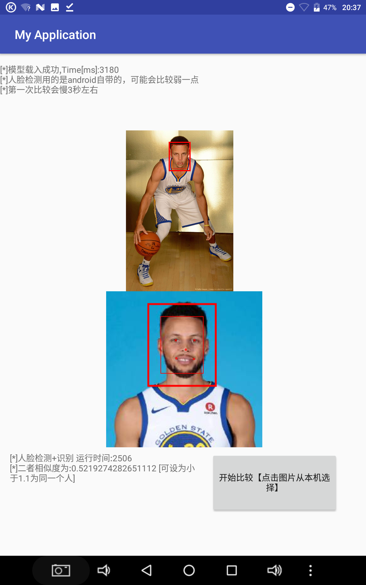

# Android_Facenet
Facenet for Android. 

* 编译环境：Android 3.1.2
* 人脸检测:MTCNN类用法 (MTCNN.Java)
  * 类实例化 MTCNN mtcnn=new MTCNN(getAssets())
  * 只有1个API：public Vector<Box> detectFaces(Bitmap bitmap,int minFaceSize)
    * 参数bitmap：要处理的图片
    * 参数minFaceSize：最小的脸像素值，一般>=40。越大则检测速度越快，但会忽略掉较小的脸
    * 返回值:所有的脸的Box，包括left/right/top/bottom/landmark(一共5个点，嘴巴鼻子眼)

* 人脸识别：FACENET类用法
  * FACENET facenet=new FACENET(getAssets())
  * 只有一个API：public FaceFeature recognizeImage(Bitmap bitmap)
    * 参数bitmap：要提取特征的人脸图片(一般先通过MTCNN检测人脸，然后crop出来)
    * 返回值：FaceFeature，人脸特征，我简单封装了一下;其实就是512维的特征向量(浮点数)
  * 人脸特征比较：即人脸特征向量的欧几里得距离。见FaceFeature.compare()
主要移植自:https://github.com/davidsandberg/facenet
# 运行效果：

